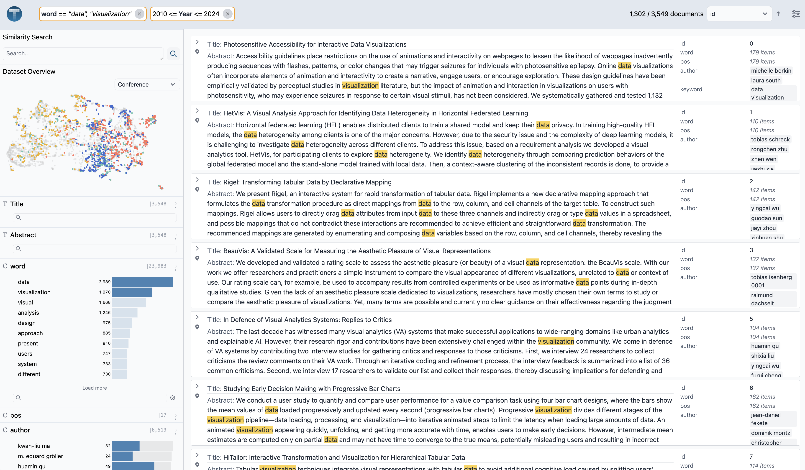

# Texture: Structured Text Analytics

[](https://pypi.org/project/texture-viz/)

Texture is a system for exploring and creating structured insights with your text datasets.

1. **Interactive Attribute Profiles**: Texture visualizes structured attributes alongside your text data in interactive, cross-filterable charts.
2. **Flexible attribute definitions**: Attribute charts can come from different tables and any level of a document such as words, sentences, or documents.
3. **Derive new attributes**: Texture helps you derive new attributes during analysis with code and LLM transformations.



## Install and run

Install texture with pip:

```bash
pip install texture-viz
```

Then you can run in a python script or notebook by providing a dataframe with your text data and attributes.

```python
import texture
texture.run(df)
```

## Texture Configuration

You can optionally pass arguments to the [`run`](./texture/runner.py) command to configure the interface. Notable configuration options are:

- `embeddings: np.ndarray`: embeddings of your text data can be provided to enable similarity search and a projection overview. If you already have a 2d projection of these embeddings, you must provide it as columns `umap_x` and `umap_y` in the dataframe.
- `column_info: List[ColumnInputInfo]`: Used to override default column types and provide derived tables. Texture will automatically infer the types (text, categorical, number, date) of your columns, but you can override here. Additionally, you can provide column information for columns from another table like words.
- `api_key`: Your OpenAI API key to enable LLM attribute derivation.

We provide various preprocessing functions to calculate embeddings, projections, and word tables. You can use these functions to preprocess your data before launching the Texture app.

```python
import pandas as pd
import texture

df_vis_papers = pd.read_parquet("https://raw.githubusercontent.com/cmudig/Texture/main/examples/vis_papers/vis_paper_data.parquet")

# get embeddings and projection
embeddings, projection = texture.preprocess.get_embeddings_and_projection(
    df_vis_papers["Abstract"], ".", "all-mpnet-base-v2"
)

df_vis_papers["umap_x"] = projection[:, 0]
df_vis_papers["umap_y"] = projection[:, 1]

# get word table
df_words = texture.preprocess.get_df_words_w_span(df_vis_papers["Abstract"], df_vis_papers["id"])

# launch texture
texture.run(
    df_vis_papers,
    embeddings=embeddings,
    column_info=[
        {"name": "Abstract", "type": "text"},
        {"name": "Title", "type": "categorical"},
        {"name": "Year", "type": "number"},
        {
            "name": "word",
            "derived_from": "Abstract",
            "table_data": df_words,
            "type": "categorical",
        },
    ],
)
```

## Dev install

See [DEV.md](DEV.md) for dev workflows and setup.
