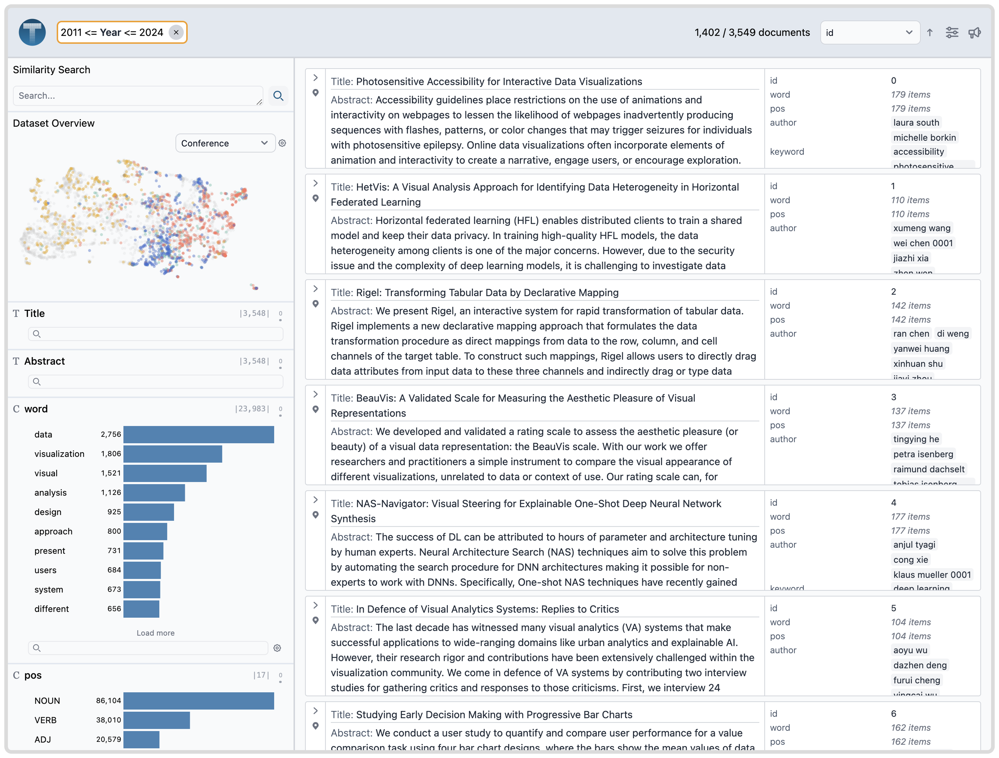

# Demo: VIS Paper Abstract Analysis

In this demo, we analyze a corpus of paper abstracts from the VIS conference with associated metadata attributes like the paper author, keywords, and citation count.
This dataset originally comes from [VisPubsData](https://sites.google.com/site/vispubdata/home).



```python
import pandas as pd
import texture
from texture.models import DatasetSchema, Column, DerivedSchema

P = "https://raw.githubusercontent.com/cmudig/Texture/main/examples/vis_papers/data/"
df_main = pd.read_parquet(P + "1_main.parquet")
df_words = pd.read_parquet(P + "2_words.parquet")
df_authors = pd.read_parquet(P + "3_authors.parquet")
df_keywords = pd.read_parquet(P + "4_keywords.parquet")

load_tables = {
    "main_table": df_main,
    "words_table": df_words,
    "authors_table": df_authors,
    "keywords_table": df_keywords,
}

schema = DatasetSchema(
    name="main_table",
    columns=[
        Column(name="Title", type="text"),
        Column(name="Abstract", type="text"),
        Column(
            name="word",
            type="categorical",
            derivedSchema=DerivedSchema(
                is_segment=True,
                table_name="words_table",
                derived_from="Abstract"
            ),
        ),
        Column(
            name="pos",
            type="categorical",
            derivedSchema=DerivedSchema(
                is_segment=True,
                table_name="words_table",
                derived_from="Abstract"
            ),
        ),
        # hierarchical non-segment
        Column(
            name="author",
            type="categorical",
            derivedSchema=DerivedSchema(
                is_segment=False,
                table_name="authors_table"
            ),
        ),
        Column(
            name="keyword",
            type="categorical",
            derivedSchema=DerivedSchema(
                is_segment=False,
                table_name="keywords_table"
            ),
        ),
        Column(name="Year", type="number"),
        Column(name="Conference", type="categorical"),
        Column(name="PaperType", type="categorical"),
        Column(name="CitationCount_CrossRef", type="number"),
        Column(name="Award", type="categorical"),
    ],
    primary_key=Column(name="id", type="number"),
    has_embeddings=True,
    has_projection=True,
)

def get_embedding(value: str):
    import sentence_transformers
    model = sentence_transformers.SentenceTransformer("all-mpnet-base-v2")
    e = model.encode(value)
    return e

texture.run(
    schema=schema, load_tables=load_tables, create_new_embedding_func=get_embedding
)

```
