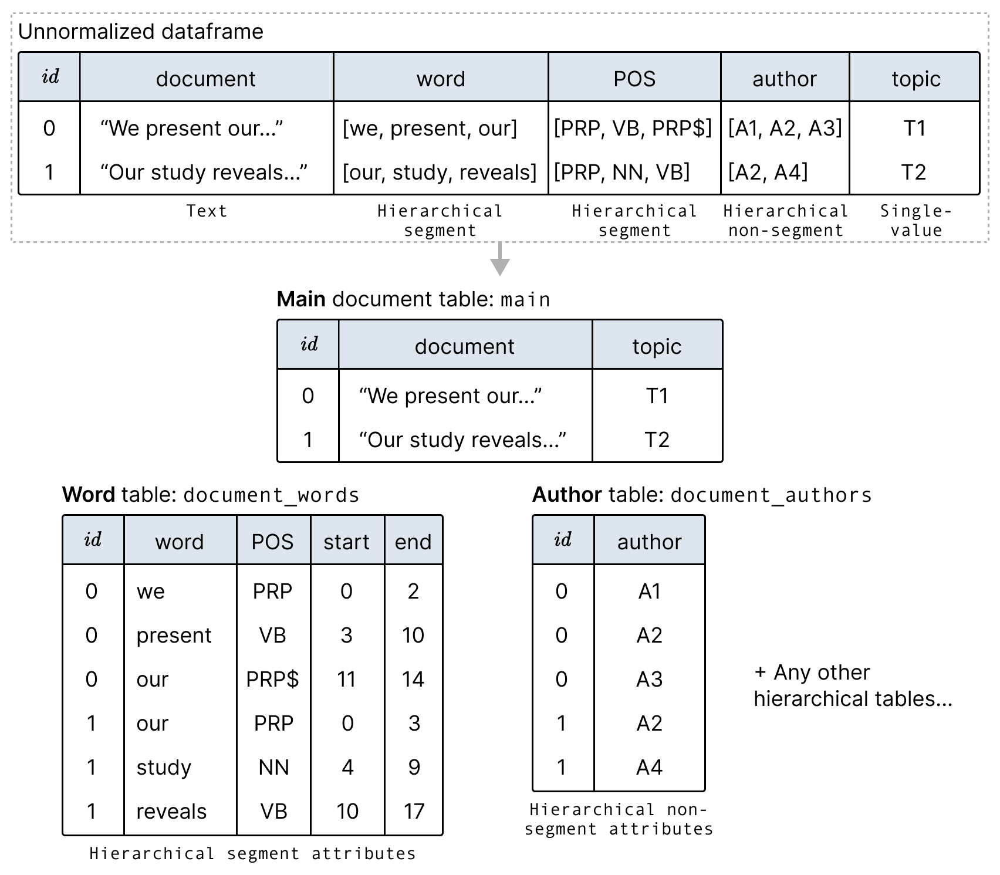

# Table Configuration

The previous section describes how to configure the Texture interface. This section describes how to configure the data that is passed to the interface.

Texture splits data into multiple tables to enable attributes with _many to one_ relationships with each document. Texture categorizes metadata into the types in the following table.

| **Data Type**                        | **Description**                                                                                      | **Example**                                        |
| ------------------------------------ | ---------------------------------------------------------------------------------------------------- | -------------------------------------------------- |
| Text                                 | The text documents                                                                                   | Paper abstracts, social media posts, news articles |
| _Metadata:_ single-value             | Metadata attribute that only has one value per document. _Number_, _categorical_, or _temporal_      | Document rating score, topic, publication date     |
| _Metadata:_ hierarchical segment     | Metadata with multiple values per document where each value maps directly to a _segment_ of the text | Words, tokens, phrases, POS tags, NER tags         |
| _Metadata:_ hierarchical non-segment | Metadata with multiple values per document that do not map directly to the text                      | List of authors, list of keywords                  |
| Vector Embeddings                    | Any high dimensional document embedding + a 2D projection                                            | GPT3 document embeddings with 2D UMAP projection   |

## Formatting your data into multiple tables

**Hierarchical** attributes are separated into multiple tables (multiple Pandas DataFrames in Python) to avoid arrays in the dataframe. This is equivalent to putting the data into [first normal form](https://en.wikipedia.org/wiki/First_normal_form) in database terminology.

For example, the following figure shows how we can split data with arrays for the `word`, `POS` (part of speech), and `author` attributes into new tables:



When creating our DatasetSchema, we then specify which table each attribute comes from:

```python
import pandas as pd
import texture
from texture.models import DatasetSchema, Column, DerivedSchema

load_tables = {
    "main": df_main,
    "document_words": df_words,
    "document_authors": df_authors,
}

schema = DatasetSchema(
    name="main",
    columns=[
        # columns from table "main"
        Column(name="document", type="text"),
        Column(name="topic", type="categorical"),

        # columns from table "document_words"
        Column(
            name="word",
            type="categorical",
            derivedSchema=DerivedSchema(
                is_segment=True,
                table_name="document_words",
                derived_from="document",
            ),
        ),
        Column(
            name="POS",
            type="categorical",
            derivedSchema=DerivedSchema(
                is_segment=True,
                table_name="words_table",
                derived_from="Abstract",
            ),
        ),

        # columns from table "document_authors"
        Column(
            name="author",
            type="categorical",
            derivedSchema=DerivedSchema(
                is_segment=False,
                table_name="authors_table",
            ),
        ),
    ],
    primary_key=Column(name="id", type="number"),
)
```

## Required Columns

### Main table

There are several reserved column names in the main table that are used in the interface.

- `id`: A unique identifier for each row.
- `vector`: _(Optional)_ A column containing embeddings for the text data.
- `umap_x` and `umap_y`: _(Optional)_ Columns containing 2d projections of the embeddings.

### Hierarchical attribute tables

Likewise, each attribute table expects a table with the following columns:

- `id`: A foreign key to the main table id.
- `<col_name>`: The categorical or quantitative data attribute.
- `span_start`: The start index of the segment in the text.
- `span_end`: The end index of the segment in the text.

::: info
Even for list attributes like authors or keywords, the table is still required to have the `span_start` and `span_end` columns. The values for these columns can be set to the array indices.
:::
